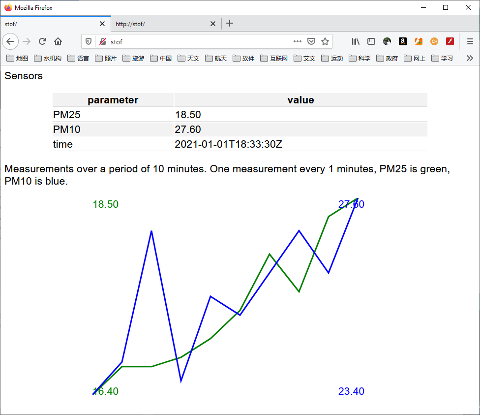

# 家气

Runs on a Wemos D1 ESP8266 board. This reads the sensor
measurements form a Nova SDS011 particulate matter sensor. It runs a
web server at (http://stof/), this endpoint shows:
* a table with latest sensor readings
* a graph of the current series of measurements
The time series is continuously updated with the latest
measurement. Time series length is configurable in the code.

